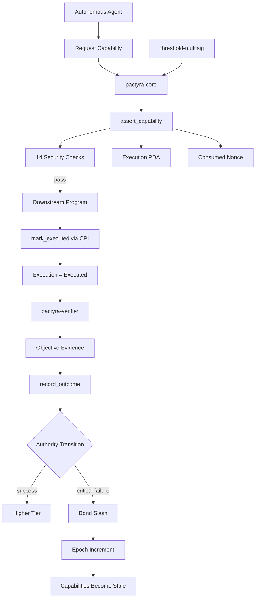

# PACTYRA

> **The economic authority layer for autonomous agents.**
>
> **AI agents already have keys. PACTYRA makes them earn the right to use them.**

[](https://github.com/sodiq-code/pactyra/actions/workflows/ci.yml)
[](https://solana.com)
[](https://pactyra-ui.vercel.app)
[](https://pactyra-ui.vercel.app/api/x402/resource)
[](LICENSE)

**Wallets prove control. Payments move value. PACTYRA determines how much economic authority an agent has earned.**

**[Live Demo](https://pactyra-ui.vercel.app)** · **[GitHub](https://github.com/sodiq-code/pactyra)** · **[Architecture](docs/architecture.md)** · **[SDK](sdk/)**

---

## The Thesis

Autonomous agents can already hold wallets, sign transactions, interact with APIs, and spend money.

The missing primitive is **earned economic authority**.

PACTYRA creates an on-chain authorization layer between an autonomous agent and the programs that control economic value.

An agent does not begin with unlimited financial power.

It starts here:

```text
$5
  ↓
verified performance
  ↓
$50
  ↓
verified performance
  ↓
$500
  ↓
critical failure
  ↓
$5 + bond slashed + epoch incremented
```

Authority is therefore not a static permission.

**It is earned, bounded, executable, and revocable.**

The core instruction is:

```text
assert_capability()
```

A valid capability must satisfy deterministic on-chain rules before the downstream program is allowed to execute.

The result is a closed loop:

```text
VERIFIED PERFORMANCE
        ↓
  EARNED AUTHORITY
        ↓
 BOUNDED EXECUTION
        ↓
 VERIFIED OUTCOME
        ↓
 AUTHORITY CHANGES
```

---

# Why PACTYRA Exists

A wallet answers:

> **Who can sign?**

A payment protocol answers:

> **How does value move?**

PACTYRA answers a different question:

> **How much economic authority has this agent actually earned?**

That distinction matters as agents become increasingly autonomous.

An agent may possess a valid private key while having very little earned trust.

PACTYRA separates:

```text
KEY OWNERSHIP
    from
ECONOMIC AUTHORITY
```

An agent can keep its key while losing its ability to move meaningful amounts of value.

That is the core idea behind PACTYRA.

---

# The Core Primitive: Evidence-Bound Capability

PACTYRA turns verified history into a machine-enforceable capability.

A capability binds an agent to:

* an action type
* a target
* an amount limit
* a frequency limit
* an expiry
* a policy
* an authority epoch

Before execution, `assert_capability()` validates the authorization on-chain.

After execution, the target program advances an on-chain `Execution` PDA.

Only then can a registered verifier record the outcome.

This makes the authority lifecycle:

```text
Request capability
        ↓
assert_capability()
        ↓
Execution PDA = Asserted
        ↓
Target program executes
        ↓
mark_executed() via CPI
        ↓
Execution PDA = Executed
        ↓
Verifier checks evidence
        ↓
record_outcome()
        ↓
Tier / bond / epoch changes
```

---

# What Makes PACTYRA Different

PACTYRA is not primarily a wallet.

It is not primarily a payment rail.

It is not primarily a monitoring dashboard.

It is an **economic authority layer** that can sit above those primitives.

The architecture is designed so that downstream programs can consume PACTYRA authority at their own execution boundary.

For example:

```text
Agent
  │
  │ requests authority
  ▼
PACTYRA Core
  │
  │ assert_capability()
  ▼
Reference Treasury
  │
  │ USDC transfer
  ▼
Execution PDA
  │
  │ mark_executed()
  ▼
Verifier
  │
  │ evidence
  ▼
Authority transition
```

The reference treasury demonstrates the strongest form of enforcement:

```text
assert_capability()
        ↓
USDC transfer
        ↓
mark_executed()
```

If capability assertion fails, the transfer does not happen.

---

# The Authority Model

| Tier               | Authority | Requirement                                                           |
| ------------------ | --------: | --------------------------------------------------------------------- |
| **T1 — Probation** |    **$5** | Initial authority                                                     |
| **T2 — Proven**    |   **$50** | 5 verified successes                                                  |
| **T3 — Trusted**   |  **$500** | 20+ successes, ≥95% success rate, zero critical failures, 5 USDC bond |

A critical verified failure causes:

```text
REAL USDC BOND SLASH
        ↓
TIER → T1
        ↓
EPOCH++
        ↓
ALL OLD CAPABILITIES → STALE
```

The agent keeps its private key.

It loses its earned authority.

That is the central security property.

---

# The Proof

PACTYRA is deployed and executable on Solana devnet.

## Live deployment

| Component                | Status         |
| ------------------------ | -------------- |
| `pactyra-core`           | Live on devnet |
| `pactyra-verifier`       | Live on devnet |
| `reference-treasury`     | Live on devnet |
| `threshold-multisig`     | Live on devnet |
| x402 V2 integration      | Live           |
| Real USDC devnet payment | Verified       |
| Automated tests          | 60 passing     |

## Program IDs

| Program              | Address                                        |
| -------------------- | ---------------------------------------------- |
| `pactyra-core`       | `EjF7VXPMk5bcDBVWfkcpN9sL93Srpo2y8zs7j7vedwSC` |
| `pactyra-verifier`   | `5dK7xXDUSHDcP8qFxrLLFo4Nm2Xzn7rSKgDMmrFFLZsN` |
| `reference-treasury` | `6gAZR4omxMUWy5Fb6kCtdmaWASFFXr9WRCoWUcAz7UA9` |
| `threshold-multisig` | `FgfW1JkSknJpcCypbhuv531qvVu2z8sNVPH2kZXLpDKc` |

---

# Live x402 Proof

PACTYRA also exposes the authority model through a real x402 V2 payment flow.

The live demo performs:

```text
HTTP request
    ↓
402 Payment Required
    ↓
PACTYRA assert_capability()
    ↓
14 on-chain security checks
    ↓
REAL USDC transfer
    ↓
X-PAYMENT
    ↓
on-chain payment verification
    ↓
HTTP 200
```

There are no simulated signatures.

The hosted demo currently produces two real Solana transactions:

1. `assert_capability()` — PACTYRA enforcement
2. USDC transfer — actual payment

### Run the live proof

```text
https://pactyra-ui.vercel.app/api/x402/demo
```

### Latest verified run

**Capability assertion**

`4jcdSDtNazgSdazdf1NzmjToXV2muM3vv63ceSVfdsMJJHEjYdEsApJbUs6pyy3MfGoyqJLEojyFUL7dbbcgDQvK`

**USDC payment**

`4Jb7qzPqVfoHFCAtoC6HqC9rhCxZBbc7fNkDGk4uEDTBVfBDMHpn3zgx7DWqvVja9FtbLX4CzaXF3yMDRbb9weKP`

[View assertion transaction](https://solana.fm/tx/4jcdSDtNazgSdazdf1NzmjToXV2muM3vv63ceSVfdsMJJHEjYdEsApJbUs6pyy3MfGoyqJLEojyFUL7dbbcgDQvK?cluster=devnet)

[View USDC payment](https://solana.fm/tx/4Jb7qzPqVfoHFCAtoC6HqC9rhCxZBbc7fNkDGk4uEDTBVfBDMHpn3zgx7DWqvVja9FtbLX4CzaXF3yMDRbb9weKP?cluster=devnet)

---

# The 14 Enforcement Checks

`assert_capability()` enforces:

1. Agent is Active
2. Capability is Active
3. Capability belongs to the Agent
4. Authority epoch is current
5. Policy matches
6. Policy is Active
7. Capability has not expired
8. Action type matches
9. Target program matches
10. Target account is in scope
11. Amount is within capability limit
12. Bond requirement is satisfied
13. Frequency limit has not been exceeded
14. Delegate scope is valid when applicable

Replay protection is separately enforced through a consumed-nonce PDA.

---

# Execution PDA: Proof That the Action Actually Happened

Authorization alone is not enough.

PACTYRA creates an `Execution` PDA when a capability is asserted.

```text
ASSERTED
   │
   │ target program calls mark_executed()
   ▼
EXECUTED
   │
   │ verifier records outcome
   ▼
RECORDED
```

The `Execution` PDA stores a deterministic `action_id`:

```text
keccak256(
  agent_id,
  capability_id,
  action_type,
  target_program,
  target_account,
  amount,
  action_nonce
)
```

This prevents a verifier from simply claiming:

> "The action succeeded."

The chain must show:

```text
authorized
    +
executed
    +
same action parameters
```

Only then can the outcome be recorded.

---

# Real Economic Consequence

PACTYRA does not merely update a database field when an agent fails.

The bond is real USDC.

`lock_bond()` transfers USDC into a PDA-controlled vault.

On a critical verified failure:

```text
Bond vault
    ↓
real USDC slash
    ↓
slash destination
```

At the same time:

```text
Tier → T1
Epoch → +1
Old capabilities → stale
```

This creates an economic consequence for bad autonomous behavior.

---

# Objective Verification

The reference verifier integrates with Pyth price data.

It validates:

* Pyth account ownership
* feed identity
* publication freshness
* evidence hash

Freshness determines the severity:

| Evidence age | Result | Severity |
| ------------ | ------ | -------- |
| ≤ 30s        | Pass   | None     |
| 30–60s       | Fail   | Ordinary |
| > 60s        | Fail   | Critical |

Critical evidence can trigger the authority downgrade path.

The verifier is also registered in the protocol's verifier registry, so arbitrary callers cannot directly fabricate outcomes.

---

# Governance

PACTYRA includes protocol-level controls for the trust root.

### 3-of-5 multisig

The protocol authority is backed by:

```text
5 members
3 required approvals
```

### 24-hour timelock

Trust-root operations are delayed:

```text
propose
  ↓
24 hour delay
  ↓
execute
```

The system supports:

* verifier registration
* verifier deprecation
* authority replacement
* agent freeze/unfreeze
* policy supersession
* session-key delegation
* timelocked operations

The result is that the authority system itself has a governed trust root.

---

# Four Solana Programs

PACTYRA is implemented as four cooperating programs.

## 1. `pactyra-core`

The authority engine.

Responsibilities:

* agent registration
* bonds
* policies
* capability issuance
* `assert_capability()`
* execution lifecycle
* authority tiers
* epochs
* outcome recording
* governance

## 2. `pactyra-verifier`

The evidence layer.

Responsibilities:

* Pyth validation
* freshness checks
* evidence hashing
* verifier-to-core CPI
* outcome severity

## 3. `reference-treasury`

The downstream consumer.

Responsibilities:

* hold USDC
* require PACTYRA authorization
* execute authorized transfers
* call `mark_executed()`

This program demonstrates that PACTYRA can become a genuine execution boundary rather than a UI-only policy engine.

## 4. `threshold-multisig`

The trust-root governance layer.

Responsibilities:

* 3-of-5 approval
* proposal lifecycle
* protocol authority operations

---

# Architecture



---

# Reference Treasury Enforcement

The strongest integration test is not the UI.

It is the treasury.

```text
reference_treasury::authorized_transfer()
                 │
                 ▼
        pactyra_core::assert_capability()
                 │
           ┌─────┴─────┐
           │           │
         FAIL         PASS
           │           │
        REVERT         ▼
                   USDC transfer
                         │
                         ▼
                  mark_executed()
```

The important property is:

> **The treasury cannot move funds unless the PACTYRA capability assertion succeeds.**

That is the protocol's enforcement boundary.

---

# x402 Integration

PACTYRA includes an x402 V2 adapter so an autonomous agent can use earned authority when paying HTTP resources.

```typescript
const adapter = new PactyraX402Adapter({
  pactyraClient: client,
  agentId,
  capabilityPda,
  rpcUrl,
  usdcMint,
  payerTokenAccount,
});

const response = await adapter.fetch("https://service.example.com/api", {
  maxAmount: 5_000_000,
  actionNonce: 1,
});
```

The important sequence is:

```text
x402 requirement
      ↓
PACTYRA capability assertion
      ↓
PASS
      ↓
USDC payment
      ↓
resource verification
```

The x402 integration demonstrates that PACTYRA can become a reusable authority layer for machine-to-machine payments.

---

# SDK

The TypeScript client is published as:

```text
@sodiq-code/pactyra-client
```

Install:

```bash
echo "@sodiq-code:registry=https://npm.pkg.github.com" >> ~/.npmrc
npm install @sodiq-code/pactyra-client
```

Example:

```typescript
import { PactyraClient } from "@pactyra/client";

const client = await PactyraClient.connect(wallet, connection);

await client.registerAgent(agentId);
await client.lockBond(5_000_000);
await client.requestCapability(params);

await client.assertCapability(agentId, {
  actionType: "payService",
  targetProgram,
  targetAccount,
  amount,
  actionNonce,
});
```

The SDK exposes the same core protocol primitives used by the on-chain system.

---

# Live Demo

**[Open PACTYRA](https://pactyra-ui.vercel.app)**

The live UI exposes:

* Agent Passport
* authority tier
* verified execution history
* bond state
* authority epoch
* execution lifecycle
* governance controls
* deployment status
* transaction history
* security checks
* x402 V2 payment demo

### The live agent intentionally shows degradation

The current demo agent is in the failure state:

```text
Tier:           T1 — Probation
Authority:      $5
Verified:       6
Successful:     5
Success rate:   83.3%
Critical:       1
Bond:           5 USDC
Epoch:          #2
Status:         Active
```

This state is intentional.

It demonstrates that:

```text
critical failure
      ↓
economic penalty
      ↓
authority downgrade
      ↓
epoch invalidation
```

The agent still possesses its key.

It simply no longer possesses the authority it had earned.

---

# Demo Story

The intended judge experience is:

### 1. Start with earned authority

Show:

```text
T1 → T2 → T3
$5 → $50 → $500
```

### 2. Attempt an unauthorized action

Request a transfer above the current capability.

Result:

```text
REJECTED
```

### 3. Show real downstream enforcement

Use `reference-treasury`.

```text
assert_capability()
      ↓
USDC transfer
```

### 4. Show objective failure

Feed the verifier stale evidence.

Result:

```text
critical failure
```

### 5. Show the economic consequence

```text
bond slashed
tier reset
epoch incremented
capabilities stale
```

### 6. Replay old authority

Attempt to use the old capability.

Result:

```text
STALE EPOCH
```

The key story is:

> **The agent did not lose its key. It lost its authority.**

---

# Business Model

PACTYRA is designed as infrastructure for systems that allow autonomous software to control economic value.

Potential customers include:

* autonomous agent platforms
* AI treasury systems
* agent payment infrastructure
* x402 services
* DeFi agents
* autonomous trading systems
* enterprise AI systems with controlled financial permissions

The product can evolve toward:

```text
Developer SDK
     +
Execution authorization fees
     +
Verifier infrastructure
     +
Enterprise policy / governance
```

The long-term opportunity is not simply safer payments.

It is a standardized authority layer for autonomous economic actors.

---

# Distribution

PACTYRA is designed to enter through existing agent infrastructure.

### Entry point

SDK + x402 adapter

### First integrations

* payment services
* autonomous treasuries
* agent frameworks
* DeFi execution systems

### Expansion

```text
one agent
   ↓
one application
   ↓
multiple applications
   ↓
shared authority infrastructure
```

Because the enforcement primitive lives at the program boundary, downstream applications can adopt PACTYRA without rebuilding their entire wallet or payment stack.

---

# Why Solana

PACTYRA needs deterministic, composable execution boundaries.

Solana provides the primitives required for this architecture:

* program-to-program invocation
* PDA-based state
* deterministic account derivation
* high-throughput execution
* low-cost transactions
* composable token infrastructure

The protocol uses those primitives to make authority enforceable at the same layer where economic actions occur.

---

# Security Model

PACTYRA's security model includes:

* deterministic capability scope
* authority epochs
* expiry / TTL
* replay protection
* frequency limits
* amount limits
* target restrictions
* real USDC bond escrow
* real bond slashing
* verifier provenance
* execution-state binding
* frozen-agent protection
* immutable/superseding policies
* 24-hour trust-root timelocks
* 3-of-5 governance

The objective is simple:

> **Authority should be difficult to gain, explicit in scope, and easy to revoke.**

---

# Test Coverage

Current repository test suite:

```text
32 formal tests
21 SDK tests
7 demo-runner tests
-------------------
60 total tests
```

Run locally:

```bash
anchor test --skip-build
```

---

# Build

## Requirements

* Rust 1.89+
* Solana CLI / Agave
* Anchor 0.31.1+
* Node.js 18+

## Install

```bash
npm install
```

## Build

```bash
anchor build
```

## Test

```bash
anchor test --skip-build
```

---

# Repository Structure

```text
pactyra/
├── programs/
│   ├── pactyra-core/
│   ├── pactyra-verifier/
│   ├── reference-treasury/
│   └── threshold-multisig/
│
├── sdk/
│   ├── src/
│   └── idl/
│
├── ui/
│   └── src/
│
├── scripts/
│   ├── bootstrap.ts
│   ├── earn-tier2.ts
│   ├── earn-tier3.ts
│   ├── unauthorized-transfer.ts
│   ├── critical-failure.ts
│   ├── stale-capability.ts
│   ├── demo-runner.ts
│   └── x402-demo.ts
│
├── tests/
│
└── docs/
    ├── architecture.md
    ├── demo-storyboard.md
    ├── pitch-script.md
    └── gtm-strategy.md
```

---

# Documentation

| Document                                   | Purpose                                 |
| ------------------------------------------ | --------------------------------------- |
| [Architecture](docs/architecture.md)       | Full protocol and security architecture |
| [Demo Storyboard](docs/demo-storyboard.md) | Judge demo sequence                     |
| [Pitch Script](docs/pitch-script.md)       | Presentation narrative                  |
| [GTM Strategy](docs/gtm-strategy.md)       | Market, positioning and distribution    |
| [SDK](sdk/)                                | Client implementation                   |
| [Programs](programs/)                      | Solana programs                         |

---

# Hackathon Development Disclosure

Crypto World's Fair permits the use of pre-existing code but requires teams to disclose relevant prior development.

This repository therefore separates the protocol's existing implementation from the work completed during the competition sprint.

**Submission disclosure should explicitly state the truthful development history of each major component, including any pre-hackathon code, reused infrastructure, and work completed during the Crypto World's Fair sprint.**

---

# Status

```text
NETWORK       Solana Devnet
PROGRAMS      4 deployed
INSTRUCTIONS  35
SECURITY      14 capability checks
TESTS         60
x402          V2
USDC          Real devnet transfers
OPEN SOURCE   MIT
```

---

# The Core Idea

Autonomous agents are going to hold money.

The hard problem is not giving them keys.

The hard problem is deciding what they have earned the right to do.

PACTYRA makes that decision programmable.

```text
KEY
 ↓
IDENTITY
 ↓
VERIFIED HISTORY
 ↓
EARNED AUTHORITY
 ↓
BOUNDED EXECUTION
 ↓
VERIFIED OUTCOME
 ↓
MORE OR LESS AUTHORITY
```

**Agents can keep their keys.**

**Their economic authority should be earned.**

---

## Links

* **Live Demo:** https://pactyra-ui.vercel.app
* **GitHub:** https://github.com/sodiq-code/pactyra
* **x402 Demo:** https://pactyra-ui.vercel.app/api/x402/demo
* **x402 Resource:** https://pactyra-ui.vercel.app/api/x402/resource
* **SDK:** `@sodiq-code/pactyra-client`
* **License:** MIT
